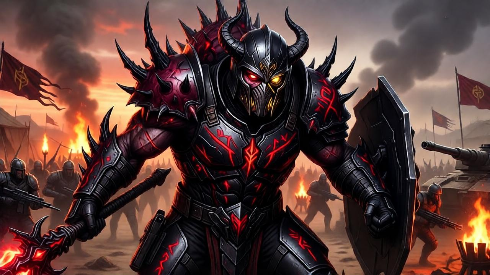

# Апофис

> [!danger] Агрессивный военачальник, претендент на трон Вел'Кетов

Апофис — военный командир Вел'Кетов, открыто бросающий вызов Ра Кену. В отличие от Верховного Владыки, Апофис делает ставку на грубую силу, военную доблесть и прямое подчинение. Его сторонники ценят его за честность — Апофис не скрывает своих амбиций и не играет в интриги.

## Внешность

**Истинная форма:** Вел'Кет-личинка тёмно-багрового цвета, крупнее стандартной. Тело покрыто шиповидными наростами — признак агрессивной мутации, вызванной многократными боевыми модификациями нанитов.

**Текущий носитель:** Массивный гуманоид с тёмной кожей и шрамами от энергетических ожогов — каждый шрам от битвы, которую Апофис вёл лично. Носитель — бывший генерал Ре'Зиров, захваченный в бою. Апофис не сменил его за 200 лет, что для Вел'Кета аномально долго — он гордится тем, что тело носителя **выдерживает** его присутствие.

**Атрибуты:** Боевые доспехи чёрного цвета с красными рунами (символы завоевания), парные жезлы Вел'Кетов, шлем с рогами в форме змеиных клыков.

## Концепт-арт

## История

### Происхождение

Апофис родился в том же инкубаторе, что и Ра Кен, но на поколение позже. С самого начала проявлял агрессию — не к носителям, а к **конкурентам**. В отличие от Ра Кена, который изучал и накапливал, Апофис **ломал**. Его первым носителем был не учёный и не политик — а воин, лучший боец сектора.

### Путь воина

Апофис не менял носителей. Он модифицировал одного — наращивал нанитовые усиления, превращая тело в живое оружие. Каждый бой добавлял шрамы, каждая победа — репутацию. Ре'Зиры в его секторе подчинялись не из страха перед паразитом, а из уважения к силе носителя.

За 500 лет Апофис завоевал три сектора, подчинил десятки миров и создал армию, которая не уступала личной армии Ра Кена.

### Конфликт с Ра Кеном

Первый открытый вызов — 2100 год. Апофис отказался передать один из завоёванных миров под контроль жрецов Ра Кена. Ра Кен не стал отвечать силой — вместо этого он изолировал Апофиса от Portal Network, отрезав от ресурсов.

Апофис нашёл обходной путь — начал строить собственные Кольца телепортации, копируя технологии Синтекс через захваченных учёных. Это было нарушение неписаного правила: только Верховный Владыка контролирует перемещение.

С тех пор конфликт нарастает. Апофис не атакует напрямую — он **подрывает**. Переманивает Владыков, создаёт теневые альянсы, демонстрирует, что его метод — сила и честность — эффективнее интриг Ра Кена.

## Психология

### Мотивация

- **Сила = право** — Апофис искренне верит, что сильнейший должен править. Ра Кен удерживает власть не силой, а хитростью — это оскорбление для Апофиса
- **Доказательство** — хочет доказать, что его путь (прямая сила, верность, честность) лучше пути Ра Кена (интриги, терпение, манипуляции)
- **Свобода** — парадоксально, но Апофис считает себя **освободителем** Вел'Кетов от тирании одного Владыки. Он хочет не уничтожить систему, а сделать её честной — где каждый Владыка имеет равный шанс

### Характер

- **Прямой** — не играет в интриги. Говорит, что думает. Это одновременно его сила и слабость
- **Безжалостный** — в бою не знает пощады. Уничтожает врагов полностью, не оставляет пленных
- **Харизматичный** — привлекает тех, кто устал от политики Ра Кена. Его армия лояльна не из страха, а из убеждения
- **Нетерпеливый** — его главная слабость. Действует быстро, иногда слишком быстро. Ра Кен использует это против него

### Отношение к носителям

Апофис не презирает носителей так, как Ра Кен. Для него носитель — **партнёр в силе**. Он сохраняет сознание носителя более активным, позволяя ему участвовать в бою. Это создаёт странную связь: носитель Апофиса — не пленник, а соучастник.

Ре'Зиры в секторе Апофиса более мотивированы, чем у других Владыков. Они верят, что служат не паразиту, а **вождю**.

## Способности

### Боевые

| Способность | Описание |
|-------------|----------|
| **Военное командование** | Бонус к координации армий — юниты под командованием Апофиса действуют как единый организм |
| **Боевой транс** | Нанитовое усиление носителя до предела — скорость, сила и регенерация увеличены втрое. Побочный эффект: сокращает жизнь носителя |
| **Парные жезлы** | Два модифицированных жезла — один для атаки, другой для щита. Может вести бой на равных с элитой Кешари |
| **Устрашение** | Аура страха — вражеские юниты низкой морали могут обратиться в бегство |

### Стратегические

| Способность | Описание |
|-------------|----------|
| **Армия Завоевателя** | Постоянная боевая готовность — армия Апофиса не знает «мирного времени». Всегда готова к вторжению |
| **Теневые альянсы** | Тайные соглашения с недовольными Владыками. Может получить подкрепление в критический момент |
| **Копирование технологий** | Захват вражеских технологий и быстрая адаптация. Армия Апофиса — самая технологически разнообразная |

### Уникальные

| Способность | Описание |
|-------------|----------|
| **Несломленный** | Носитель Апофиса не может быть захвачен через нанитовую сеть Ра Кена. Апофис модифицировал нанитов для защиты от контроля Владыки |
| **Зов войны** | Боевой клич, усиливающий все юниты Ре'Зиров в радиусе. Чем больше армия, тем сильнее эффект |

## Заговор

Апофис не просто бросает вызов — он **готовит переворот**.

### Сторонники

- **3 Владыка** — открыто поддерживают Апофиса, контролируют 15% территорий Вел'Кетов
- **5 Владыков** — тайно симпатизируют, ждут момента для перехода
- **Чистые Воины** — значительная часть элитной гвардии уважает Апофиса больше, чем Ра Кена
- **Жрецы-реформаторы** — молодые жрецы, желающие модернизировать нанитовые технологии

### План

1. **Ослабить Ра Кена** — постоянные провокации на границах секторов, истощение ресурсов
2. **Переманить Владыков** — демонстрация силы + обещания автономии после победы
3. **Захватить Гоа'ол** — удар по цитадели, когда Ра Кен отвлечён внешней угрозой
4. **Публичная дуэль** — Апофис хочет победить Ра Кена лично, перед всеми Владыками. Не убить из тени — сломить в бою

### Слабости плана

- Ра Кен знает о заговоре. Он **позволяет** ему развиваться, чтобы выявить всех нелояльных
- Апофис нетерпелив — может ударить слишком рано
- Если Владыки не поддержат, Апофис окажется изолирован

## Отношения

| Персонаж | Отношение | Описание |
|----------|-----------|----------|
| [[Ра Кен]] | Узурпатор и трус | Апофис презирает Ра Кена за хитрость и нежелание сражаться лично. Но в глубине души — боится его накопленной силы |
| Владыки-сторонники | Инструменты и братья | Единственные Вел'Кеты, которых Апофис уважает. Но если они предадут — уничтожит первым |
| Ре'Зиры | Воины | Видит в них не рабов, а армию. Требует лояльности, но даёт уважение в ответ |
| Чистые Воины | Настоящие Вел'Кеты | Считает Чистых Воинов единственными «чистыми» представителями расы |

## Ключевые события

- **~2700 до н.э.** — Первое паразитирование, выбор воина-Ре'Зира как носителя
- **~2400 до н.э.** — Захват первого сектора, начало военной карьеры
- **~2100 год** — Первый открытый вызов Ра Кену, начало конфликта
- **2200 год** — Первая Война Порталов. Армия Апофиса играла ключевую роль, но Ра Кен присвоил себе славу
- **2350 год** — Текущее время. Заговор набирает силу, 3 Владыка открыто на стороне Апофиса

## Связанные заметки

- [[00 Вел'Кеты MOC]]
- [[Ра Кен]]
- [[Фракция]]
- [[Гоа'ол]]
- [[Ре'Зиры]]
