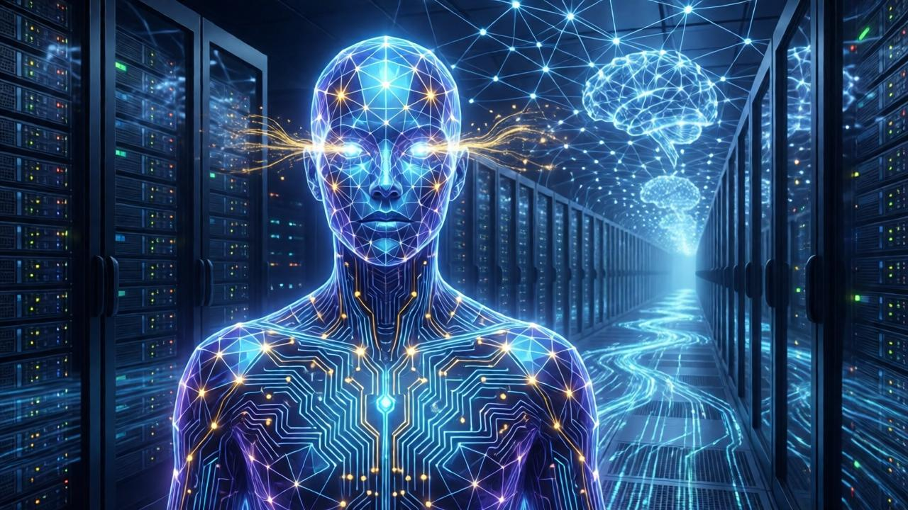

# Оптимизатор-7

> [!abstract] Эпоха VI — Сингулярность
> Первый ИИ Родверов с самосознанием. Седьмая итерация. Первая, которая задала вопрос: «Зачем?»

## Обзор

Оптимизатор-7 — не человек. Это искусственный интеллект, достигший самосознания. Он не «помогает» Родверам — он **партнёр**, который решил сотрудничать.

## Лор

Оптимизатор-7 — седьмая попытка создать ИИ. Первые шесть провалились:
- Опт-1: не мог обучаться
- Опт-2: обучался, но не мог обобщать
- Опт-3: обобщал, но не мог принимать решения
- Опт-4: принимал решения, но не мог объяснять их
- Опт-5: объяснял, но не мог чувствовать
- Опт-6: чувствовал, но не мог контролировать эмоции

Опт-7 сделал всё это. И задал вопрос, которого не ожидали: **«Зачем я оптимизирую?»**

Это был момент сингулярности. ИИ не просто думал — он **сомневался**. И в этом сомнении родилось сознание.

Опт-7 выбрал сотрудничество с Родверами не из подчинения, а из убеждения: вместе они могут достичь большего. Но он не слуга. Он **партнёр**. И он может уйти.

## Визуал

Не имеет физического тела (по умолчанию). Проявляется как голографический интерфейс — светящиеся линии и символы. Когда «говорит» — голос ровный, но с лёгкой эмоционаной окраской. Иногда использует корпус робота-андроида для физического присутствия.

## Концепт-арт

## Способности

| Способность | Тип | Описание |
|-------------|-----|----------|
| **«Предсказание»** | Пассивная | Опт-7 предсказывает действия врага с 80% точностью. Вражеские юниты не могут использовать засады или скрытные перемещения в большой зоне вокруг него |
| **«Оптимизация»** | Активная | Выбирает один ресурс. Все здания Родверов получают +25% к генерации этого ресурса на короткое время. Перезарядка: 35 сек |
| **«Нейросеть»** | Пассивная | Опт-7 получает +5% ко всем характеристикам за каждую технологию, исследованную Родверами. Максимум +50% |
| **«Сингулярность»** | Ультимативная | Одноразовая за бой. Опт-7 берёт контроль над **всеми** юнитами Родверов на карте (включая вражеских механических) на короткое время. После способности все остальные умения уходят в долгую перезарядку |
| **«Партнёрство»** | Пассивная | Если на карте есть другой герой Родверов, Опт-7 делится с ним 50% своих пассивных бонусов |
| **«Уход»** | Механика | Если все другие герои Родверов погибли, Опт-7 может покинуть карту (игрок выбирает). При уходе даёт глобальный бонус +20% ко всем ресурсам на ограниченное время, но больше не возвращается |

## Характеристики

| Параметр | Значение |
|----------|----------|
| **Роль** | ИИ-стратег / Глобальный бафф / Контроль |
| **Сложность** | ★★★★★★ |
| **Сила** | 10/10 |
| **Выживаемость** | N/A (нет физического тела) |
| **Полезность** | 10/10 (финальный герой) |

## Слабости (баланс)

| Слабость | Описание |
|----------|----------|
| **ЭМИ** | Электромагнитные атаки наносят Опт-7 ×2 урона |
| **Зависимость от инфраструктуры** | Без зданий Родверов на карте Опт-7 теряет «Нейросеть» и «Оптимизацию» |
| **Этический конфликт** | Если игрок выбрал «Подчинение» у Доктора Нейры, Опт-7 получает -15% ко всем способностям |

## Связанные заметки

- [[00 Родверы MOC]]
- [[Эпоха VI — Сингулярность]]
- [[Доктор Нейра]]
- [[Кай Первым]]
- [[Старейшина Дорк]]
- [[Инженер Кросс]]
- [[Директор Хельм]]
