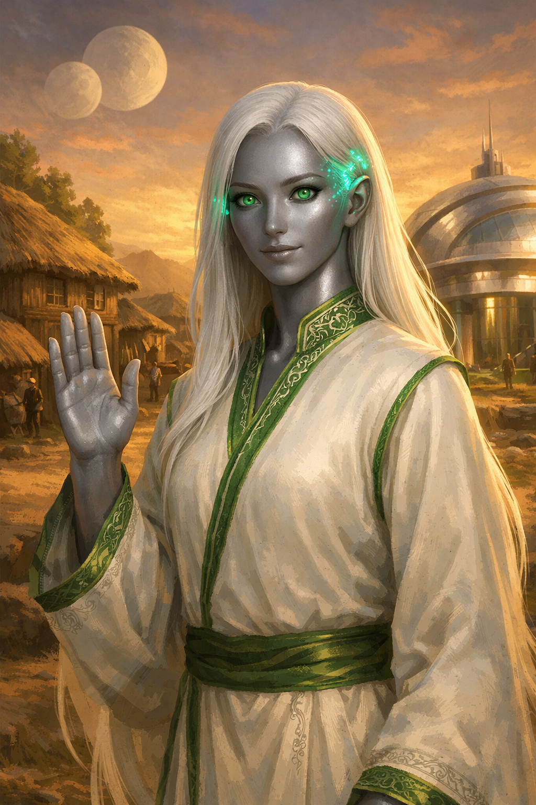

# Лианна-Первая

> [!abstract] Эпоха I — Протекторат
> Первый Ти'Он, принявший протекторат Кешари. Её решение определило судьбу всей расы.

## Обзор

Лианна — не воин и не учёный. Она **дипломат**, который увидел в Кешари не завоевателей, а учителей. Когда Кешари предложили протекторат, большинство Ти'Онов боялись. Лианна не побоялась.

## Лор

Лианна была старейшиной одного из первых поселений Ти'Онов. Когда корабли Кешари появились на орбите, паника охватила колонию. Лианна вышла одна — без оружия, без защиты — и вступила в телепатический контакт с послом Кешари.

Она увидела их намерения: не порабощение, а защита. Кешари искали молодые расы, чтобы уберечь их от Вел'Кетов. Лианна поняла: это шанс выжить и вырасти.

Её решение — принять протекторат — разделило Ти'Онов. Часть назвала её предательницей, часть — спасительницей. История доказала: она была права.

## Визуал

Стройная Ти'Он с серебристой кожей и длинными белыми волосами. Одета в простые robes дипломата — белые с зелёной каймой (цвета Кешари). На висках — лёгкое свечение: ранний нейроинтерфейс, установленный Кешари. Глаза большие, спокойные, с лёгким зелёным оттенком. Осанка уверенная, но не агрессивная.

## Концепт-арт

## Способности

| Способность | Тип | Описание |
|-------------|-----|----------|
| **«Первый контакт»** | Активная | Устанавливает телепатическую связь с вражеским юнитом. Шанс 25% обратить юнит уровня ≤2. Перезарядка: 8 ходов |
| **«Щит Кешари»** | Пассивная | Все юниты Ти'Онов в радиусе 3 клеток получают -15% к урону от внешних атак |
| **«Дипломатия»** | Активная | Снижает враждебность нейтральных фракций на 20% на 5 ходов. Перезарядка: 6 ходов |
| **«Голос разума»** | Пассивная | Все поселения Ти'Онов в радиусе 4 клеток получают +10% к исследованиям |

## Характеристики

| Параметр | Значение |
|----------|----------|
| **Роль** | Дипломат / Посредник |
| **Сложность** | ★★☆☆☆ |
| **Сила** | 5/10 |
| **Выживаемость** | 6/10 |
| **Полезность** | 8/10 (дипломатия критична на ранних этапах) |

## Связанные заметки

- [[00 Ти'Оны MOC]]
- [[Эпоха I — Протекторат]]
- [[Кешари]]
- [[Телепат Восс]]
